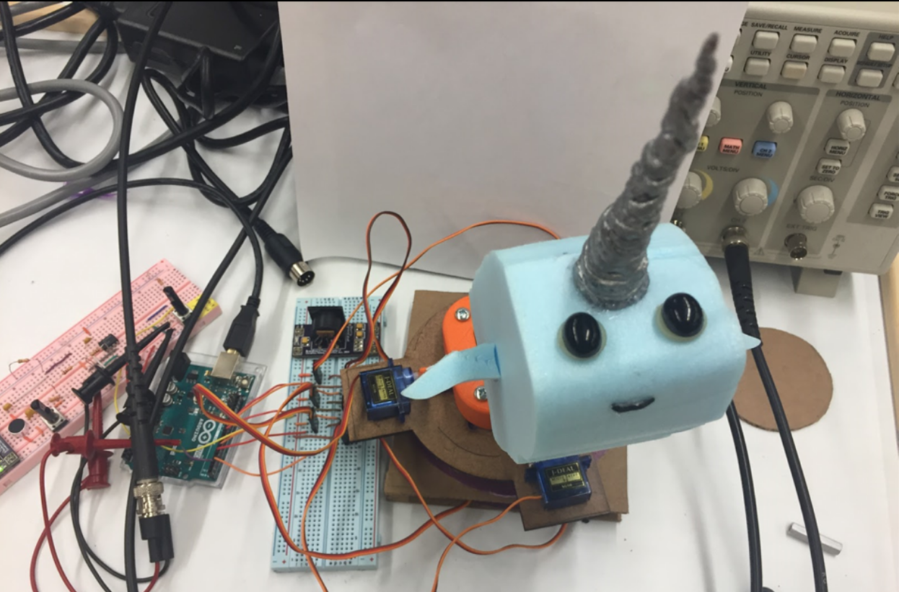

### Designers
Tabi Silver
Jocelyn Shiue
Jean Huang
Under the guidance of James Battat. 
With the help of Amy Banzaert, Dave Barrett, and Larry Knowles.

# dancing-narwhal

We built a dancing narwhal that utilizes an analog low-pass filter for beat detection. Beat detection input is initially gathered by a microphone, whose millivolt signal is re-centered around 1.5 V and amplified to fill the 0~4 V range before reaching the Arduino Uno. Movement is provided by 6 servos, 4 below and 2 above a mobile platform: the lower servos provide vertical bopping and twisting motions and the upper servos in conjunction with a 3D-printed joystick provide side-to-side and forward-to-backward rocking motions. 

This project was inspired by the [Keepon Interaction Robot](http://hackedgadgets.com/2007/05/12/keepon-interaction-robot/) but designed as a budget-friendly alternative that does not involve color CCD cameras or isolated degrees of freedom for motion. Follow the links for video footage of the Dancing Narwhal in action to a [metronome at 60bpm](https://drive.google.com/file/d/1wT9AU9BOb4FNnWL8drw-6Y8vV8Q_eiHr/view) and an [EDM beat](https://drive.google.com/file/d/1axfPUlJRtLbN8Afj4aEk1b8CxvxzGM91/view).

[I'm an inline-style link](https://www.google.com)

### Parts List
[Materials used](https://docs.google.com/spreadsheets/d/1dPhJONiIlOeWQd743ps2o8NfRmKt0imZAqSkSL3BILo/edit) amounts to a total budget of $57.40. This budget does not include the purchase price of the tools used, including:
1. Foam cutter 
2. Drill press
3. Table Saw
4. Sander
5. Tap and driver 
6. Laser Printer
7. Frequency generator
8. BNC cords (2) and wire clip to BNC connectors
9. Screw cutters
10. Oscilloscope
11. Hot glue gun

### Project Construction 
There are three main components to the construction of this dancing robot (accentuated in the block diagram below): A) audio signal input, B) beat detection to pulse formation, C) structural design.

